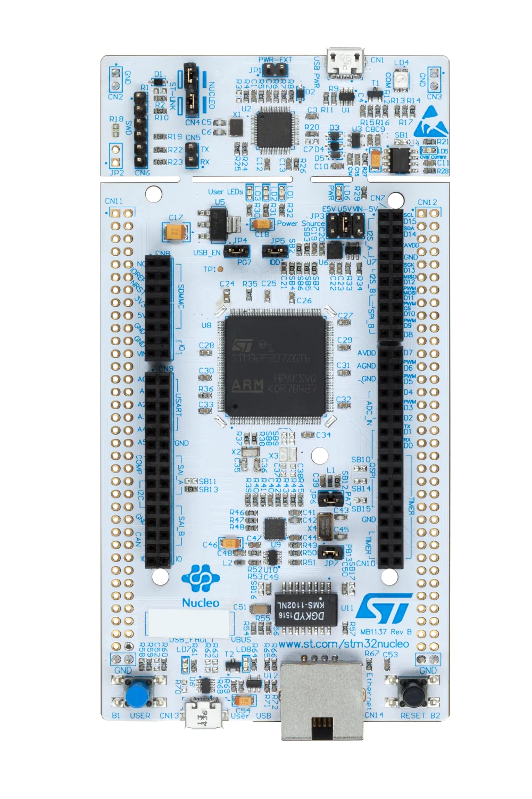

..
    Copyright 2023 MicroEJ Corp. All rights reserved.
    Use of this source code is governed by a BSD-style license that can be found with this software.

.. |BOARD_NAME| replace:: NUCLEO-F429ZI
.. |BOARD_REVISION| replace:: MB1137-Rev.B
.. |RCP| replace:: MICROEJ SDK
.. |VEEPORT| replace:: VEE Port
.. |SIM| replace:: Simulator
.. |CIDE| replace:: MICROEJ SDK
.. |RTOS| replace:: FreeRTOS
.. |MANUFACTURER| replace:: STMicroelectronics
.. |MICROEJ_ARCHITECTURE_VERSION| replace:: 8.0.0
.. |MICROEJ_SDK_VERSION| replace:: 23.07
.. |TOOLCHAIN| replace:: IAR Embedded Workbench for Arm
.. |TOOLCHAIN_VER| replace:: 8.50.9

.. _README BSP: ./stm32f429zi_nucleo_freertos-bsp/projects/microej/README.rst
.. _RELEASE NOTES: ./RELEASE_NOTES.rst
.. _CHANGELOG: ./CHANGELOG.rst

=========================================
|VEEPORT| for |MANUFACTURER| |BOARD_NAME|
=========================================
.. image:: https://shields.microej.com/endpoint?url=https://repository.microej.com/packages/badges/sdk_5.8.json
   :alt: sdk_5.8 badge
   :align: left

.. image:: https://shields.microej.com/endpoint?url=https://repository.microej.com/packages/badges/arch_8.0.json
   :alt: arch_8.0 badge
   :align: left

This project is used to build a |VEEPORT| for the |BOARD_NAME|
development board.

Clone the repository with ``git clone --recursive https://github.com/MicroEJ/VEEPort-STMicroelectronics-STM32F429ZI_NUCLEO.git``.

Related Files
=============

This directory also contains:

* `CHANGELOG`_ to track the changes in the |VEEPORT| for |BOARD_NAME| 
* `RELEASE NOTES`_ to list:

  - the supported hardware,
  - the known issues and the limitations,
  - the development environment,
  - the list of the dependencies and their versions.

* `README BSP`_ recommended for users familiar with the
  |MANUFACTURER| SDK/BSP and advanced usage on how to customize the build
  process.

Board Technical Specifications
==============================

.. list-table::

   * - Name
     - |BOARD_NAME|
   * - Revision
     - |BOARD_REVISION|
   * - MCU part number
     - STM32F429ZI
   * - MCU revision
     - 3
   * - MCU architecture
     - Cortex-M4
   * - MCU max clock frequency
     - 180 MHz
   * - Internal flash size
     - 2 MBytes
   * - Internal RAM size
     - 256 KBytes
   * - External flash size
     - 0 Byte
   * - External RAM size
     - 0 Byte
   * - Power supply
     - 5V, 3.3V, 

Here is a list of |BOARD_NAME| useful documentation links:

- Board documentation available `here <https://www.st.com/resource/en/data_brief/nucleo-f429zi.pdf>`__
- |MANUFACTURER| board Getting Started available `here <https://www.st.com/resource/en/user_manual/um1727-getting-started-with-stm32-nucleo-board-software-development-tools-stmicroelectronics.pdf>`__
- Board schematics available `here <https://www.st.com/resource/en/schematic_pack/nucleo_144pins_sch.zip>`__
- MCU Technical Reference Manual available `here <https://www.st.com/resource/en/reference_manual/rm0090-stm32f405415-stm32f407417-stm32f427437-and-stm32f429439-advanced-armbased-32bit-mcus-stmicroelectronics.pdf>`__
- MCU Datasheet available `here <https://www.st.com/resource/en/datasheet/stm32f429zi.pdf>`__
- MCU Errata available `here <https://www.st.com/resource/en/errata_sheet/es0206-stm32f427437-and-stm32f429439-device-errata-stmicroelectronics.pdf>`__

|VEEPORT| Specifications
========================

The Architecture version is |MICROEJ_ARCHITECTURE_VERSION|.

This |VEEPORT| provides the following Foundation Libraries:

.. list-table::
   :header-rows: 1

   * - Foundation Library
     - Version
   * - EDC
     - 1.3
   * - BON
     - 1.4
   * - SNI
     - 1.4

The |VEEPORT| is derived into:

- a Mono-Sandbox |VEEPORT| (default)

Requirements
============

- PC with Windows 10
- Internet connection to `MicroEJ Central Repository <https://developer.microej.com/central-repository/>`_
- |RCP| Dist. |MICROEJ_SDK_VERSION| or higher, available `here <https://developer.microej.com/microej-sdk-software-development-kit/>`_
- |BOARD_NAME| board

BSP Setup
=========

Install the |MANUFACTURER| toolchain as described `here
<https://www.iar.com/products/architectures/arm/iar-embedded-workbench-for-arm/>`__.

Windows Toolchain
-----------------

- C/C++ toolchain name: |TOOLCHAIN|
- C/C++ toolchain version: |TOOLCHAIN_VER|
- C/C++ toolchain `download link <https://www.iar.com/ewarm>`__

Please refer to the |MANUFACTURER| documentation available `here
<https://www.st.com/en/evaluation-tools/nucleo-f429zi.html#documentation>`__
for more details.

BSP Compilation
---------------

The |VEEPORT| provides a pre-compiled Standalone Application.
Validate the BSP installation by compiling the BSP to build a |BOARD_NAME|
Firmware.

To build the ``stm32f429zi_nucleo_freertos-bsp`` project, open a
terminal and enter the following command lines:

**On Windows:**

.. code-block:: sh

      $ cd "xxx/stm32f429zi_nucleo_freertos-bsp/projects/microej/scripts"
      $ build.bat 

The build script expects the toolchain to be installed at a known
path.  If you installed it elsewhere, see `README MicroEJ BSP`_ for
how to customize its path.

Please refer to `README MicroEJ BSP`_ for more details on how to
customize the build scripts.

Board Setup
===========

Please refer to the |MANUFACTURER| documentation available `here
<https://www.st.com/resource/en/user_manual/um1974-stm32-nucleo144-boards-mb1137-stmicroelectronics.pdf>`__
for more details.

Power Supply
------------

The STM32 Nucleo-64 board is designed to be powered by several DC power supplies. It is
possible to supply the STM32 Nucleo-64 board with any of the following sources:

- 5V_USB_STLK from the ST-LINK USB connector
- VIN (7 V - 12 V) from ARDUINO® connector 
- 3.3 V on ARDUINO® connector 
- ...

Please refer to the |MANUFACTURER| documentation available `here
<https://www.st.com/resource/en/user_manual/um1974-stm32-nucleo144-boards-mb1137-stmicroelectronics.pdf>`__
for more details.

Programming
-----------

The |BOARD_NAME| board can be flashed following the steps below:

**On Windows:**

.. code-block:: sh

      $ cd "xxx/veeport-bsp/projects/microej/scripts"
      $ run.bat 

The firmware is launched. Please wait for the final message:

.. code-block::

     CSpyBat terminating.

Logs Output
-----------

This |VEEPORT| uses uses the STLink connection to output UART logs to the PC host.
The COM port uses the following parameters:

The COM port uses the following parameters:

.. list-table::
   :widths: 3 2

   * - Baudrate
     - 115200
   * - Data bits bits
     - 8 bits
   * - Parity bits
     - None
   * - Stop bits
     - 1
   * - Flow control
     - None

If flashed, the pre-compiled application outputs ``Hello World`` on
the UART.

Please refer to the |MANUFACTURER| documentation available `here
<https://www.st.com/resource/en/user_manual/um1974-stm32-nucleo144-boards-mb1137-stmicroelectronics.pdf>`__
for more details.

Debugging
---------

Firmware debugging can be done using the IAR debugger tools.

Please refer to the `README BSP`_ section debugging for more
details.

|VEEPORT| Setup
===============

|VEEPORT| Import
----------------

Import the projects in |RCP| Workspace:

- ``File`` > ``Import`` > ``Existing Projects into Workspace`` >
  ``Next``
- Point ``Select root directory`` to where the project was cloned.
- Click ``Finish``

Inside |RCP|, the selected example is imported as several projects
prefixed by the given name:

- ``stm32f429zi_nucleo_freertos-configuration``: Contains the
  |VEEPORT| configuration description. Some modules are described in a
  specific sub-folder / with some optional configuration files
  (``.properties`` and / or ``.xml``).

- ``stm32f429zi_nucleo_freertos-bsp``: Contains a ready-to-use BSP
  software project for the |BOARD_NAME| board, including a
  |CIDE| project, an implementation of MicroEJ core engine (and
  extensions) port on |RTOS| and the |BOARD_NAME| board
  support package.

- ``stm32f429zi_nucleo_freertos-fp``: Contains the board description
  and images for the |SIM|. This project is updated once the |VEEPORT|
  is built.

- ``STM32F429ZI_NUCLEO-VEEPort-CM4hardfp_IAR83-{version}``:
  Contains the |RCP| |VEEPORT| project which is empty by default until
  the |VEEPORT| is built.

By default, the |VEEPORT| is configured as a Mono-Sandbox Evaluation
|VEEPORT| (Please refer to the `RELEASE NOTES`_ limitations section for more details).

|VEEPORT| Build
---------------

To build the |VEEPORT|, please follow the steps below:

- Right-click on ``stm32f429zi_nucleo_freertos-configuration``
  project in your |RCP| workspace.
- Click on ``Build Module``

The build starts.  This step may take several minutes.  The first
time, the |VEEPORT| build requires to download modules that are
available on the MicroEJ Central Repository.  You can see the progress
of the build steps in the |RCP| console.

Please wait for the final message:

.. code-block::

                          BUILD SUCCESSFUL

At the end of the execution the |VEEPORT| is fully built for the
|BOARD_NAME| board and is ready to be used.

The |VEEPORT| project should be refreshed with no error in the |RCP|
``STM32F429ZI_NUCLEO-VEEPort-CM4hardfp_IAR83-{version}``.

Please refer to
https://docs.microej.com/en/latest/ApplicationDeveloperGuide/standaloneApplication.html
for more information on how to build a MicroEJ Standalone Application.

An evaluation license is needed for building an application. Please refer to
https://docs.microej.com/en/latest/overview/licenses.html#evaluation-license
for information on how to acquire and activate a license.

Troubleshooting
===============

